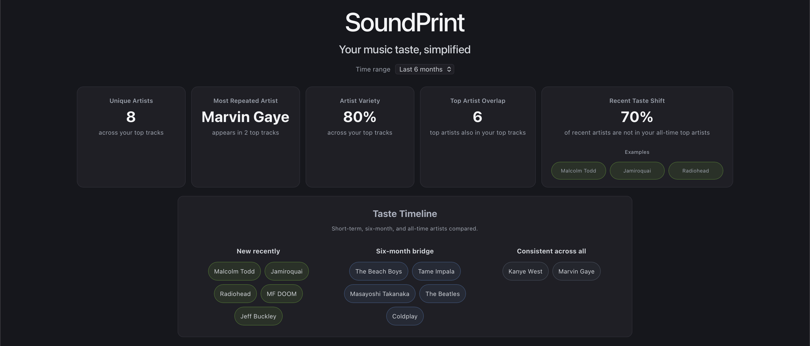
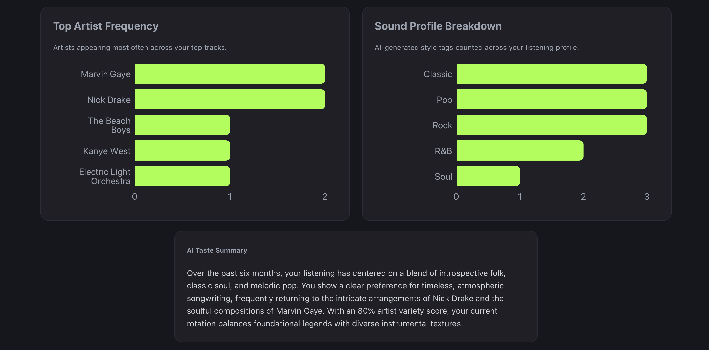
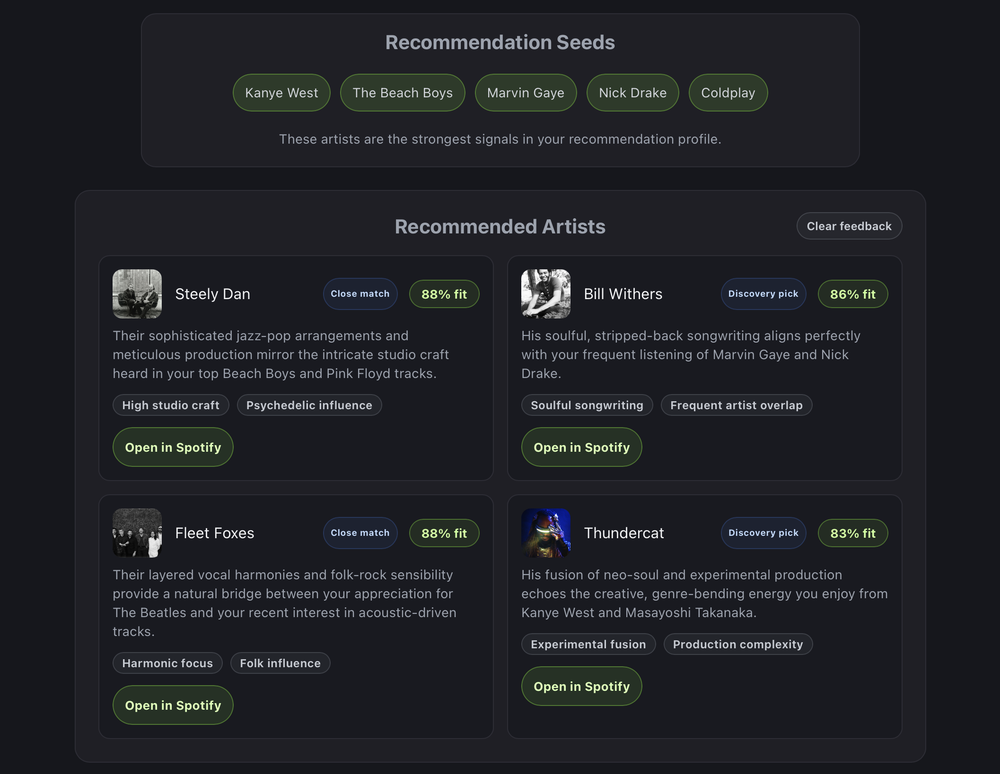

# SoundPrint

SoundPrint is a Spotify analytics app that turns listening data into explainable taste insights, recent-vs-long-term comparisons, AI-generated summaries, and data-informed artist recommendations.

## Screenshots

### Dashboard Overview


### AI Taste Analysis


### Recommended Artists


## Demo Flow

1. Connect Spotify to load listening data.
2. Select a time range for top tracks and artists.
3. Review taste metrics, artist frequency, and recent vs long-term taste changes.
4. Read the AI-generated taste summary and sound profile breakdown.
5. Explore recommended artists with fit scores, signal tags, and Spotify links.

## Features

- Spotify OAuth login with PKCE
- Top tracks and top artists by time range
- Album covers and artist images from the Spotify API
- Backend-generated taste analytics with FastAPI
- Artist frequency chart
- Recent taste shift metric and comparison panel for short-term vs all-time artists
- AI-generated taste summary using Gemini
- Gemini-generated recommended artists based on listening profile signals
- Backend cleanup that removes duplicate recommendations and already-known artists
- Recommendation signal tags explaining why each artist fits
- Direct Spotify artist links for recommended artists, with search fallback when no exact match is found
- Recommendation fit scores based on cleaned signal tags and listening profile metrics
- Spotify artist images on recommended artist cards when an exact artist match is found
- Clickable recommendation fit scores with explanations
- AI-generated sound profile breakdown with reusable style tags counted from the user's listening patterns

## Recommendation System

SoundPrint recommendations are generated from profile signals including top artists, top tracks, artist frequency, artist variety, top artist overlap, repeated artists, and recent taste shift. Each recommendation also receives a simple fit score based on cleaned signal tags and profile metrics such as artist variety, top artist overlap, and recent taste shift. Fit scores start from a base score and increase based on matching recommendation signals and profile-level metrics.

Recommended artist names are checked against Spotify Search API results so the app can link to exact artist pages and show artist images when possible. If no exact match is found, SoundPrint falls back to a Spotify search link.

Gemini is used to generate possible artists and explanations, but the backend validates the response before returning it to the frontend. The backend filters out artists already present in the user's top artists or recommendation seeds, removes duplicate results, requires valid names and reasons, cleans up signal tags, and limits results to four recommendations.

## Tech Stack

- React
- TypeScript
- FastAPI
- Python
- Recharts
- Spotify Web API
- Gemini API

## Architecture

The frontend handles Spotify authentication, Spotify data fetching, dashboard rendering, loading/error states, and recommendation display.

The backend computes listening analytics, builds prompts from structured taste signals, generates AI summaries and recommendations with Gemini, and validates AI recommendation output before sending it back to the frontend.

## Running Locally

Run the backend and frontend in separate terminals.

### Backend

```bash
cd backend
python3 -m uvicorn main:app --reload
```

### Frontend

```bash
cd frontend
npm install
npm run dev
```

## Environment Variables

Create a `backend/.env` file:

```env
GEMINI_API_KEY=your_gemini_api_key_here
```

## Current Analytics

- Unique artists across top tracks
- Most repeated artist
- Artist variety score
- Top artist overlap
- Artist frequency
- Recent taste shift
- Recent vs long-term artist comparison
- Recommendation seeds
- Recommendation signal tags
- Most common sound profile tags

## Roadmap

- Improve recommendation explanations using more of the user's listening patterns
- Add more charts for sound profile and taste-shift patterns
- Compare recent, medium-term, and long-term taste with more detailed breakdowns
- Explore taste groups or clusters based on listening patterns
- Deploy the app
- Add a short demo video/GIF showing the full app
